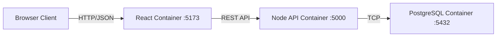
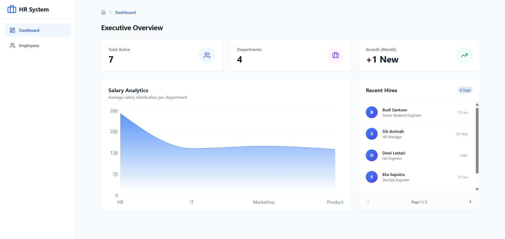
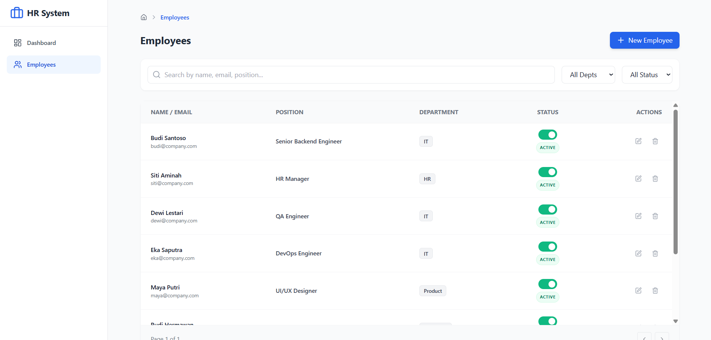
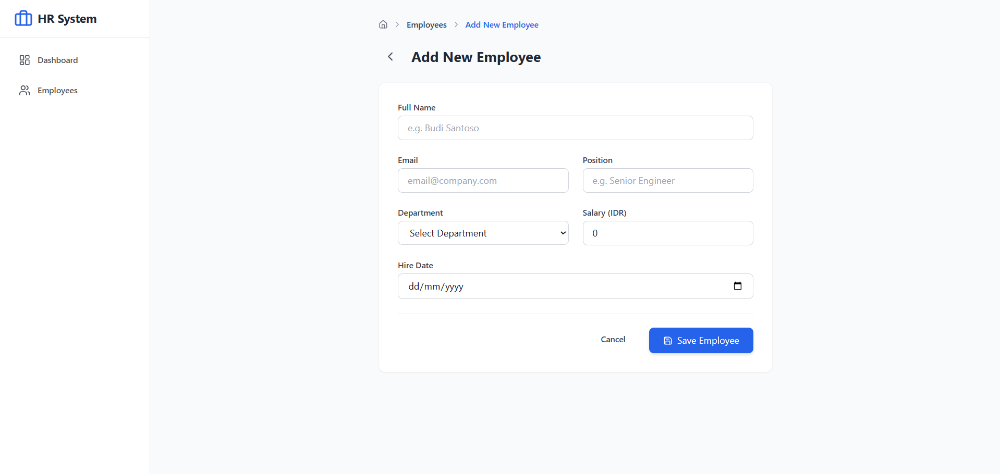

# 🏢 Employee Management System (EMS)


> **Enterprise-grade Full Stack Application** designed for modern HR administration. Built with scalability, maintainability, and clean architecture in mind.

---

## 📑 Table of Contents
1. [Project Overview](#-project-overview)
2. [System Architecture](#-system-architecture)
3. [Prerequisites](#-prerequisites)
4. [Installation & Setup](#-installation--setup)
5. [Key Features](#-key-features)
6. [API Documentation](#-api-documentation)
7. [Project Structure](#-project-structure)
8. [Challenges & Solutions](#-challenges--solutions)
9. [Future Roadmap](#-future-roadmap)
10. [Screenshots](#-screenshots)

---

## 🔭 Project Overview

The **Employee Management System (EMS)** is a centralized platform designed to streamline workforce management. It enables HR administrators to manage employee records, visualize workforce distribution, and track hiring trends through an interactive dashboard.

The application strictly adheres to **Clean Code** principles, utilizing **MVC Architecture** for the backend and **Atomic Design/Feature-based Architecture** for the frontend. It is fully containerized using Docker to ensure consistency across development and production environments.

### 🛠 Tech Stack

| Domain | Technology | Rationale |
| :--- | :--- | :--- |
| **Frontend** | React (Vite) + TypeScript | High performance, type safety, and modern tooling. |
| **State Mgmt** | TanStack Query (v5) | Efficient server-state management, caching, and auto-refetching. |
| **Styling** | Tailwind CSS + Framer Motion | Rapid UI development with smooth, professional animations. |
| **Backend** | Node.js (Express) | Scalable, event-driven architecture with clear separation of concerns. |
| **Database** | PostgreSQL 15 | robust relational database with ACID compliance. |
| **ORM** | Prisma | Type-safe database queries and automated migrations. |
| **DevOps** | Docker & Docker Compose | "Write once, run anywhere" deployment strategy. |

---

## 🏗 System Architecture

The application runs on a multi-container architecture orchestrated by Docker Compose.



---

## ⚙ Prerequisites

To run this application as intended (containerized), ensure your system meets the following requirements:

### Required Software
* **Docker Desktop** (Engine v20.10+) - *Primary requirement for Part 4 evaluation.*
* **Git** (For cloning the repository).

### System Requirements
* **OS:** Windows 10/11 (WSL2), macOS, or Linux.
* **RAM:** Minimum 4GB (8GB recommended for running multiple containers).
* **Ports:** Ensure ports `5000` (Backend), `5173` (Frontend), and `5433` (Database Host) are available.

*Note: Node.js and PostgreSQL do **not** need to be installed locally as they run within isolated Docker containers.*

---

## 🚀 Installation & Setup

Follow these step-by-step instructions to get the application running.

### 1. Clone the repository
Open your terminal and run:
```bash
git clone <repository-url>
cd employee-management-system
```

### 2. Install dependencies (Optional)
Note: Docker will automatically install dependencies inside the containers. Run this locally only if you want code completion/intellisense in VS Code.

```bash
# Backend
cd backend && npm install
# Frontend
cd ../frontend && npm install
cd ..
```

### 3. Configure environment variables
The application requires environment variables to connect the services securely.

1.  Create a `.env` file in the **root directory**.
2.  Copy the content from `.env.example`.
```bash
cp .env.example .env
```

### 4. Run with Docker Compose
This command will build the images, create the network, start the database, and launch the application.

```bash
docker-compose up --build
```

### 5. Access the application
Once the containers are running, access the services via your browser:

* **Frontend (UI):** [http://localhost:5173](http://localhost:5173)
* **Backend (API Check):** [http://localhost:5000](http://localhost:5000)

---

## ✨ Key Features

### 📊 Executive Dashboard
* **Interactive Charts:** Area charts visualizing average salary distribution per department.
* **Real-time Metrics:** Total active employees, departmental breakdown, and monthly growth.
* **Paginated Recent Hires:** Client-side pagination for browsing recent additions.

### 👥 Advanced Employee Management
* **Smart Search:** Multi-column search (Name, Email, Position, Department).
* **Sticky Table Headers:** Optimized UX for viewing large datasets.
* **Soft Delete System:**
    * **Toggle Status:** Deactivate employees (Soft Delete) with a warning dialog.
    * **Trash:** Permanently delete employees (Hard Delete) with a danger dialog.

### 🛡️ Robust Validation & UX
* **Real-time Validation:** Forms utilize Zod schema validation (e.g., Minimum Salary IDR 1M, valid Email).
* **Feedback System:** Dynamic Toast notifications (Success, Error, Info) and Loading Skeletons.
* **Responsive Design:** Fully optimized for Mobile and Desktop views.

---

## 📡 API Documentation

Base URL: `http://localhost:5000/api/employees`

| Method | Endpoint | Description | Request Body |
| :--- | :--- | :--- | :--- |
| `GET` | `/` | Get list (Filter, Search, Paginate) | - |
| `GET` | `/:id` | Get single employee details | - |
| `POST` | `/` | Create new employee | `{ name, email, position, department, salary, hire_date }` |
| `PUT` | `/:id` | Update employee details | `{ name, email, ... }` |
| `DELETE`| `/:id` | Permanently delete employee | - |
| `GET` | `/stats` | Get Dashboard analytics | - |

**Sample Curl Command (Search):**
```bash
curl "http://localhost:5000/api/employees?search=Manager&page=1&limit=5"
```
---

## 📂 Project Structure

The project follows a scalable Monorepo-like structure with clear separation of concerns.

```text
root/
├── backend/                  # REST API Service (Express + TypeScript)
│   ├── prisma/               # Database Schema & Migrations
│   ├── src/
│   │   ├── config/           # DB Connection (Singleton Pattern)
│   │   ├── controllers/      # Business Logic & Request Handling
│   │   ├── middleware/       # Global Error Handling
│   │   ├── routes/           # API Route Definitions
│   │   ├── utils/            # Zod Schemas & Helper Functions
│   │   ├── app.ts            # Express App Configuration
│   │   └── server.ts         # Server Entry Point
│   └── Dockerfile            # Backend Container Config
├── frontend/                 # React UI Service (Vite + TypeScript)
│   ├── src/
│   │   ├── components/       # Component-Based Architecture
│   │   │   ├── dashboard/    # Specific Dashboard Widgets
│   │   │   ├── employees/    # Employee-specific Features
│   │   │   └── ui/           # Reusable Atomic Components (Card, Button, etc.)
│   │   ├── hooks/            # Custom React Query Hooks (Data Layer)
│   │   ├── pages/            # Page Controllers / Layouts
│   │   └── lib/              # Shared Utilities (Axios, Schemas)
│   └── Dockerfile            # Frontend Container Config
├── database/
│   └── init.sql              # Auto-seeding Script for PostgreSQL
├── docker-compose.yml        # Container Orchestration Config
└── README.md                 # Project Documentation
```

---

## 💡 Challenges & Solutions

During the development process, several technical challenges were encountered and resolved to ensure enterprise-grade stability.

### 1. Cross-Platform Compatibility (Docker & Prisma)
* **Challenge:** Prisma requires specific binary targets to run correctly on Alpine Linux containers (used in Docker), which differ from the local development environment (Windows/Mac).
* **Solution:** Configured `binaryTargets` in `schema.prisma` to explicitly include both `"native"` and `"linux-musl-openssl-3.0.x"`. Additionally, manual installation of `openssl` was added to the backend Dockerfile to support Prisma's cryptographic requirements.

### 2. Node.js & Vite Versioning
* **Challenge:** The latest version of Vite requires Node.js 20+, causing build failures on older default Node.js images.
* **Solution:** Standardized all Dockerfiles (both Frontend and Backend) to use `node:22-alpine`. This ensures long-term support, compatibility with modern tooling, and keeps the image size minimal.

### 3. Responsive Data Visualization
* **Challenge:** Rendering complex data charts (Area Charts) that remain readable on both wide desktop screens and narrow mobile devices.
* **Solution:** Utilized `Recharts`'s `ResponsiveContainer` wrapper combined with Tailwind CSS Grid system. The layout automatically stacks components on mobile and expands them on desktop, ensuring a seamless UX across devices.

---

## 🔮 Future Roadmap

If given more time, the following features would be prioritized to further enhance the application's capabilities:

* **Authentication & Authorization (JWT):** Implement secure login for HR administrators and role-based access control (RBAC) to distinguish between Admin (Write access) and Employee (Read-only access) views.
* **Data Export:** Add functionality to export the employee list to CSV or Excel formats for external reporting.
* **Automated Testing:** Implement unit and integration tests using `Jest` (for Backend) and `Vitest` (for Frontend) to ensure code reliability and prevent regression.
* **CI/CD Pipeline:** Setup GitHub Actions to automatically lint, build, and run tests upon every commit to the repository.

---

## 📸 Screenshots

### Executive Dashboard
> *Real-time insights on salary distribution and recent hires.*


### Employee List (Active & Inactive)
> *Advanced data grid with soft delete toggles and multi-column search.*


### Add/Edit Form with Validation
> *Secure form with real-time validation and responsive layout.*


---
